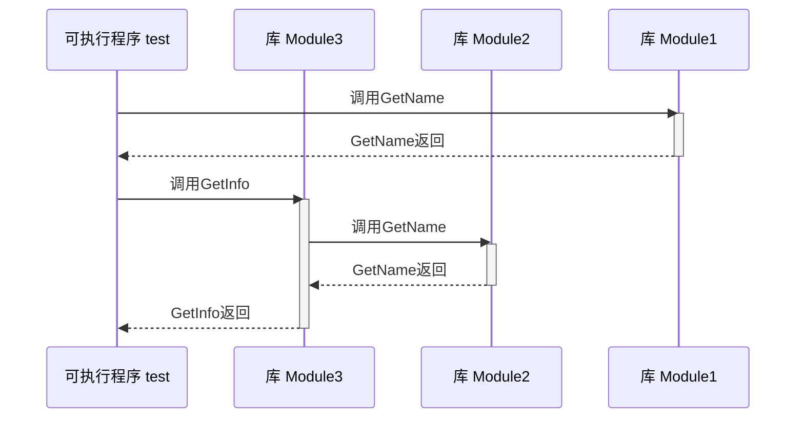

# CMakeDemo

# 编译环境

Linux 使用 docker 运行 ubuntu

需要安装：
- build-essential
- cmake
- tree
- curl

# demo23序列图

```mermaid
sequenceDiagram
    participant T as 可执行程序 test
    participant M3 as 库 Module3
    participant M2 as 库 Module2
    participant M1 as 库 Module1
    T->>M1: 调用GetName
    activate M1
    M1-->>T: GetName返回
    deactivate M1
    T->>M3: 调用GetInfo
    activate M3
    M3->>M2: 调用GetName
    activate M2
    M2-->>M3: GetName返回
    deactivate M2
    M3-->>T: GetInfo返回
    deactivate M3
```