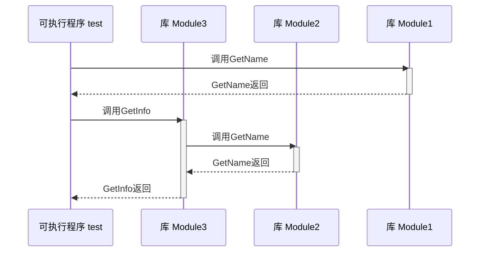

# CMakeDemo

# 编译环境

Linux 使用 docker 运行 ubuntu

需要安装：
- build-essential
- cmake
- tree
- curl

# demo23序列图



# demo25

使用 libc++ 静态库
```
set(CMAKE_CXX_FLAGS_INIT "${CMAKE_CXX_FLAGS_INIT} -static-libstdc++ -stdlib=libc++")
```

如果SDK抽取ubuntu 20.04 默认 libc++的版本是10
```
set(CMAKE_CXX_FLAGS_INIT "${CMAKE_CXX_FLAGS_INIT} -L${CMAKE_SYSROOT}/usr/lib/llvm-10/lib")
set(CMAKE_CXX_FLAGS_INIT "${CMAKE_CXX_FLAGS_INIT} -I${CMAKE_SYSROOT}/usr/lib/llvm-10/include/c++/v1")
```

# demo26-1

MacOS可以合并
```sh
llvm-lipo-18 -create ./product/macos/aarch64/test_cpp ./product/macos/x86_64/test_cpp -output ./product/test_cpp
```

# demo27

编译Windows时，docker 要提权运行，例如

```sh
docker run --rm -it --privileged -v /Users/tumi/source/github/CMakeDemo:/source clang18-cross-ubuntu24:aarch64 bash
```

# demo28

编译环境和提取SDK
安装 glib-compile-resources
```sh
apt-get install libglib2.0-dev
```

运行环境
```sh
apt-get install libglib2.0-0
```

ubuntu 20.04 默认的libglib 版本是 2.64
ubuntu 24.04 默认的libglib 版本是 2.80

# demo29

安装 libc++ 库

llvm源配置: https://apt.llvm.org/

```dockerfile
FROM ubuntu:20.04

ENV DEBIAN_FRONTEND=noninteractive

RUN apt-get -y update
RUN apt-get -y install wget
RUN wget -qO- https://apt.llvm.org/llvm-snapshot.gpg.key | tee /etc/apt/trusted.gpg.d/apt.llvm.org.asc
RUN echo "deb http://apt.llvm.org/focal/ llvm-toolchain-focal-19 main" >> /etc/apt/sources.list
RUN apt-get -y update
RUN apt-get -y install build-essential
RUN apt-get -y install cmake
RUN apt-get -y install libarchive-dev
RUN apt-get -y install libc++-19-dev
RUN apt-get -y clean
```

```dockerfile
FROM ubuntu:22.04

ENV DEBIAN_FRONTEND=noninteractive

# arm64/v8(即aarch64) 的docker镜像 apt-get install 遇到了问题
# 添加
# RUN rm /var/lib/dpkg/info/libc-bin.*
# 在这个位置
RUN apt-get -y update
RUN apt-get -y install wget
RUN wget -qO- https://apt.llvm.org/llvm-snapshot.gpg.key | tee /etc/apt/trusted.gpg.d/apt.llvm.org.asc
RUN echo "deb http://apt.llvm.org/jammy/ llvm-toolchain-jammy-19 main" >> /etc/apt/sources.list
RUN apt-get -y update
RUN apt-get -y install build-essential
RUN apt-get -y install cmake
RUN apt-get -y install libarchive-dev
RUN apt-get -y install libc++-19-dev
RUN apt-get -y clean
```
