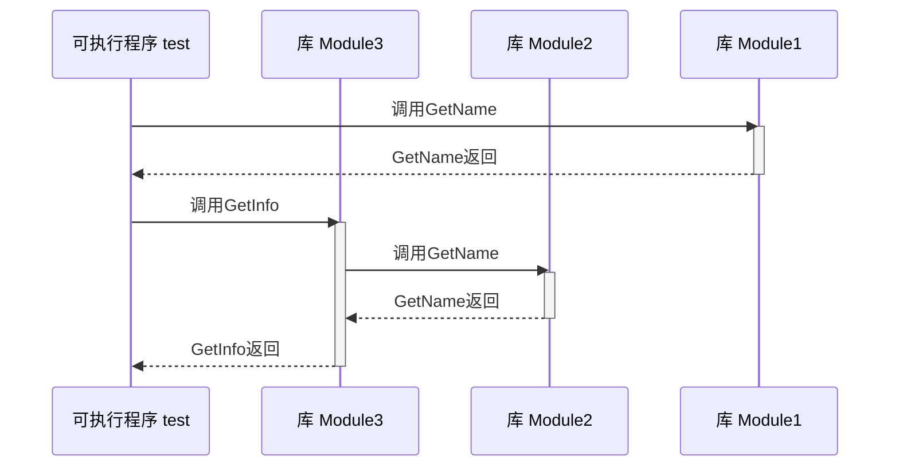

# CMakeDemo

# 编译环境

Linux 使用 docker 运行 ubuntu

需要安装：
- build-essential
- cmake
- tree
- curl

# demo23序列图



# demo25

使用 libc++ 静态库
```
set(CMAKE_CXX_FLAGS_INIT "${CMAKE_CXX_FLAGS_INIT} -static-libstdc++ -stdlib=libc++")
```

如果SDK抽取ubuntu 20.04 默认 libc++的版本是10
```
set(CMAKE_CXX_FLAGS_INIT "${CMAKE_CXX_FLAGS_INIT} -L${CMAKE_SYSROOT}/usr/lib/llvm-10/lib")
set(CMAKE_CXX_FLAGS_INIT "${CMAKE_CXX_FLAGS_INIT} -I${CMAKE_SYSROOT}/usr/lib/llvm-10/include/c++/v1")
```
# demo26

MacOS可以合并
```sh
llvm-lipo-18 -create ./product/macos-aarch64/test ./product/macos-x86_64/test -output ./product/test
```
# demo27

编译Windows时，docker 要提权运行，例如

```sh
docker run --rm -it --privileged -v /Users/tumi/source/github/CMakeDemo:/source clang18-cross-ubuntu24:aarch64 bash